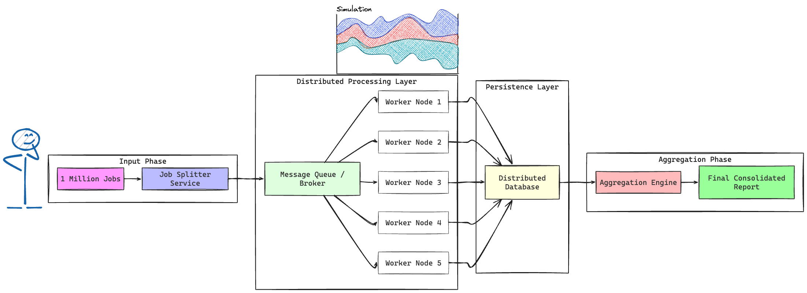
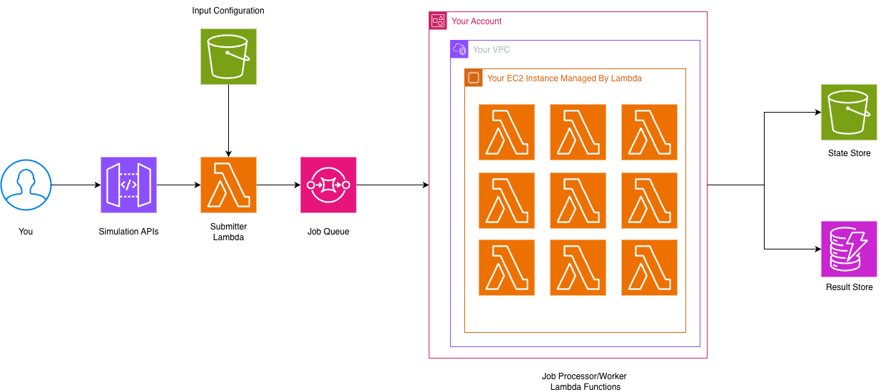
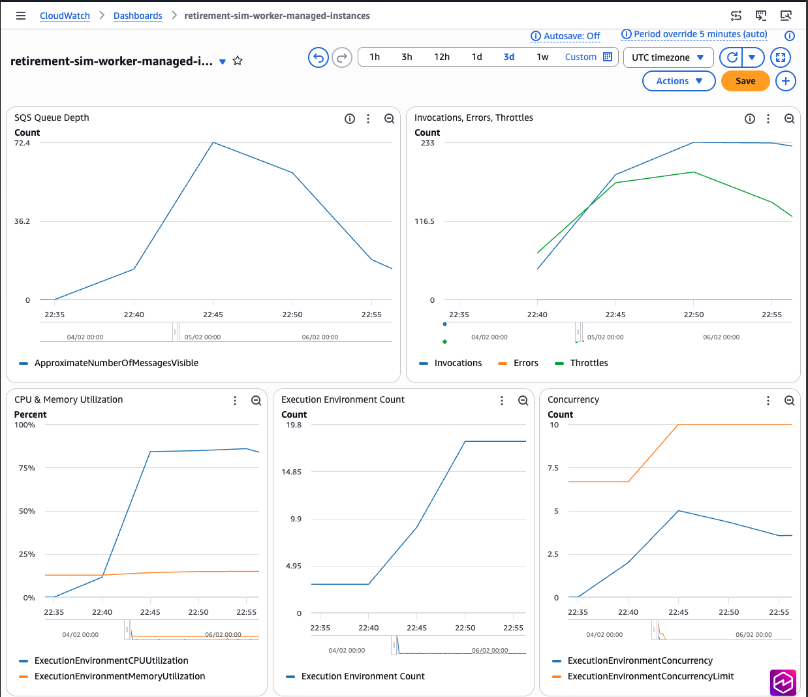
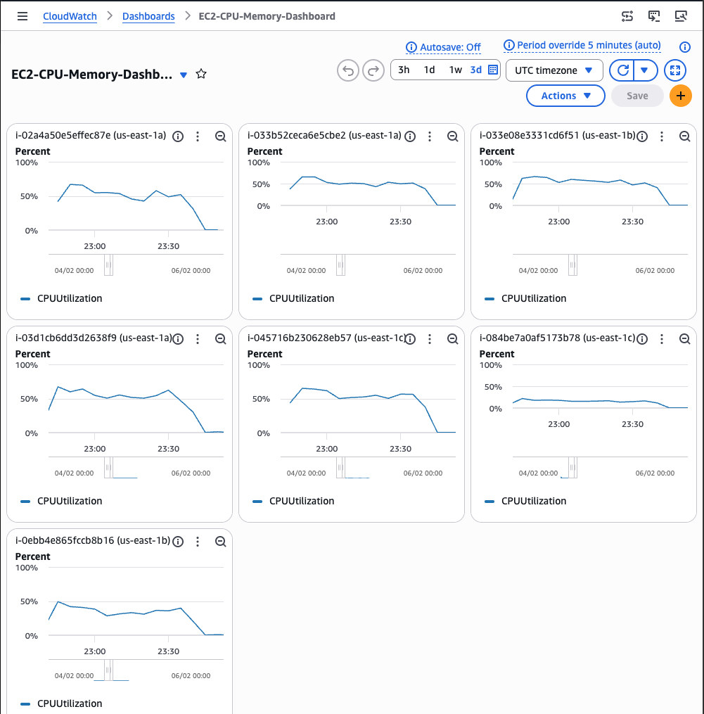

# Retirement Savings Simulator on Lambda Managed Instances

An AWS Sample demonstrating Lambda Managed Instances (LMI) for sustained
CPU-intensive Monte Carlo simulation.

---

**Contents**

[Problem Statement](#problem-statement) | [Solution Using LMI](#solution-using-lambda-managed-instances-lmi) | [Prerequisites](#prerequisites) | [Quick Start](#quick-start) | [Sample Output](#sample-output) | [Load Testing and LMI Scaling Behavior](#load-testing-and-lmi-scaling-behavior) | [Observability and Monitoring](#observability-and-monitoring) | [Cleanup](#cleanup) | [Conclusion](#conclusion)

---


## Problem Statement

### The Business Scenario

You run a financial advisory firm: 100 advisors, 10 clients each daily, each asking "Will I have enough to retire?" Simple formulas mislead—markets don't deliver a steady 7% annually. Monte Carlo simulation shows the full distribution of outcomes across hundreds of thousands of scenarios, from worst case (5th percentile) to best case (95th percentile), with the probability of hitting each client's goal. At 1,000+ simulations daily, each requiring 10–15 minutes of sustained CPU-intensive compute, this is exactly the workload *Lambda Managed Instances* handles efficiently.

### Why Monte Carlo Simulation?

Instead of one prediction ("You'll have $900K"), Monte Carlo runs hundreds of thousands of scenarios using Geometric Brownian Motion—random monthly returns compounded over years, producing realistic paths through bull markets, crashes, and recoveries. Running 1 million scenarios totals billions of floating-point operations: 30–60 minutes sequentially, but your advisors need results in minutes. The output answers the three questions clients care about: worst realistic outcome (5th percentile), most likely outcome (median), and probability of reaching a savings target.

Simulation is "embarrassingly parallel"—each scenario runs independently. When you request 1 million scenarios, a coordinator splits the work into 1,000 chunks and queues them. Workers pull chunks and process independently, then an aggregator combines the results. Ten workers can reduce a 30-minute job to approximately 3 minutes.



*Figure: A single job is split into multiple independent work items, distributed across worker nodes for parallel processing, with results stored in a distributed database and aggregated at the end.*

### What Goes In (Input)

You provide a client's retirement profile: initial savings (
$100K), monthly contribution ($1K), years to retirement (20), expected annual
return (7%), and market volatility (15%)—for example, a 45-year-old with
$100K saved, contributing $1,000/month, retiring at 65 with a balanced
portfolio.

```json
{
  "initialSavings": 100000,
  "monthlyContribution": 1000,
  "yearsToRetirement": 20,
  "annualReturn": 0.07,
  "volatility": 0.15
}
```

The system adds simulation parameters (`totalScenarios`: 1M, `shards`: 10) and
stores the complete configuration in S3.

### What Comes Out (Output)

The simulation produces a distribution showing worst case (
$450K at 5th percentile), most likely ($850K median), and best case ($1.5M at
95th percentile)—far more valuable than a single number because it shows the
range of uncertainty and helps clients make informed decisions about saving more
or working longer.

```text
RETIREMENT SAVINGS DISTRIBUTION
------------------------------------------------
 5th Percentile (worst case):       $450,000.00
 50th Percentile (median):          $850,000.00
 95th Percentile (best case):     $1,500,000.00
 Mean (average):                    $900,000.00
 Standard Deviation:                $285,000.00
```

## Solution Using Lambda Managed Instances (LMI)

AWS Lambda Managed Instances (LMI) runs AWS Lambda functions on longer-lived
AWS-managed compute instances while preserving Lambda's programming model and
developer experience. LMI helps reduce cold starts (NumPy loads once and stays
warm across invocations), provides cost-efficient pricing (Amazon EC2 instance
hours instead of per-millisecond billing), enables right-sized compute
(compute-optimized instances with configurable memory-to-vCPU ratios), supports
high concurrency (10 invocations per instance), and is designed to minimize
operational overhead (no container images, cluster management, or capacity
planning).



## Prerequisites

AWS CLI, AWS SAM CLI (v1.152.0+), Python 3.13, and Bash shell.

**VPC with VPC Endpoints (required):** LMI runs Lambda functions on EC2 instances
inside your VPC. These instances need VPC endpoints to reach AWS services. Your
VPC must have:

- 2+ private subnets across availability zones
- **Gateway VPC endpoints** for Amazon S3 and Amazon DynamoDB (free)
- **Interface VPC endpoints** for Amazon SQS, Amazon CloudWatch Logs, and Amazon CloudWatch Monitoring

If you don't have a VPC with these endpoints, deploy the included
`vpc-template.yaml` first (see [Quick Start](#quick-start) step 1). Without VPC
endpoints, the worker function will not be able to process messages or write logs.

**Cost Warning:** This sample creates billable AWS resources. The primary cost
drivers are EC2 instances (c6i.2xlarge at $0.34/hr each, managed by LMI) and
interface VPC endpoints ($0.01/hr per endpoint per AZ). LMI keeps instances
running after jobs complete, so **costs accrue while the stack is deployed**:

| Component | Per hour (idle) | Per day (idle) |
|---|---|---|
| EC2 instances (minimum for AZ resiliency) | ~$0.68 | ~$16.32 |
| Interface VPC endpoints (4 endpoints × 2 AZs) | ~$0.08 | ~$1.92 |
| **Total idle cost** | **~$0.76** | **~$18.24** |

Running a single job adds negligible cost (~$0.01 for SQS/DynamoDB/S3). The load
test (240 clients, 7 instances, ~1hr) adds ~$2.50 in EC2 time. **Delete the stack
promptly after testing to avoid ongoing charges.**

### IAM Roles and Permissions

This sample automatically creates IAM roles following the principle of least
privilege. The CloudFormation template creates four roles:

1. **SubmitterRole** - Job submission Lambda function with permissions to read S3 configuration files, write to DynamoDB jobs table, and send messages to SQS
2. **WorkerRole** - Worker Lambda function with VPC access, permissions to read S3 input, write S3 output, update DynamoDB, and process SQS messages
3. **AggregatorRole** - Results aggregation Lambda function with read-only access to S3 output bucket and DynamoDB jobs table
4. **CapacityProviderOperatorRole** - LMI capacity provider with EC2 permissions to launch and manage instances on your behalf

These are NOT service-linked roles. The template creates them with minimal
required permissions scoped to specific resources (buckets, tables, queues)
created by this stack. Review the IAM policies in `template.yaml` (lines
136-240) before deployment to ensure they meet your security requirements.

### VPC and Network Security

LMI runs Lambda functions on EC2 instances inside your VPC. Unlike standard
Lambda functions that access AWS services via the public internet, LMI instances
in private subnets require VPC endpoints to reach services like SQS, S3, and
DynamoDB. Without these endpoints, the worker function cannot process messages,
store results, or write logs.

The application template creates a security group with the following configuration:

- **Egress Rules**: HTTPS only (port 443) to 0.0.0.0/0 for AWS API calls via VPC endpoints
- **Ingress Rules**: None (Lambda functions are invoked via the AWS API)

**VPC Requirements:**

| Endpoint | Type | Purpose | Cost |
|----------|------|---------|------|
| Amazon S3 | Gateway | Read configs, write results | Free |
| Amazon DynamoDB | Gateway | Update job progress | Free |
| Amazon SQS | Interface | Delete processed messages | $0.01/hr per AZ |
| CloudWatch Logs | Interface | Write execution logs | $0.01/hr per AZ |
| CloudWatch Monitoring | Interface | Publish EMF metrics | $0.01/hr per AZ |
| AWS X-Ray | Interface | Distributed tracing | $0.01/hr per AZ |

If you don't have a VPC with these endpoints, use the included `vpc-template.yaml`
(see [Quick Start](#quick-start) step 1). If you bring your own VPC, ensure the
subnets span at least 2 Availability Zones and have sufficient IP addresses for
EC2 instances (recommend /24 or larger subnets).

## Quick Start

### 1. Deploy VPC Infrastructure (if needed)

If you already have a VPC with the required VPC endpoints (see [Prerequisites](#prerequisites)), skip to step 2 and note your VPC ID and subnet IDs.

Otherwise, deploy the included VPC template:

```bash
aws cloudformation deploy \
  --template-file vpc-template.yaml \
  --stack-name retirement-sim-vpc \
  --parameter-overrides ProjectName=retirement-sim
```

Get the VPC outputs for the next step:

```bash
aws cloudformation describe-stacks \
  --stack-name retirement-sim-vpc \
  --query 'Stacks[0].Outputs' --output table
```

### 2. Deploy the Application Stack

```bash
sam build
sam deploy --guided
```

Follow the prompts:

- Stack name: `retirement-sim`
- AWS Region: `us-east-1` (or your preferred region)
- **VpcId**: Enter your VPC ID (from step 1 or your existing VPC)
- **SubnetIds**: Enter comma-separated subnet IDs (at least 2, such as `subnet-abc123,subnet-def456`)
- Confirm changes: `Y`
- Allow SAM CLI IAM role creation: `Y`
- Save arguments to configuration: `Y`

### 3. Upload a Configuration

```bash
cd scripts
./upload-config.sh conservative-saver
```

Available configurations: `conservative-saver` (low risk, 20 years), `aggressive-investor` (high risk, 30 years), `young-starter` (long horizon, 40 years), `near-retirement` (short horizon, 5 years).

### 4. Submit a Job

Get the API endpoint from AWS CloudFormation outputs:

```bash
API_ENDPOINT=$(aws cloudformation describe-stacks \
  --stack-name retirement-sim \
  --query "Stacks[0].Outputs[?OutputKey=='ApiEndpoint'].OutputValue" \
  --output text)
```

Submit a job using curl:

```bash
curl -X POST $API_ENDPOINT \
  -H "Content-Type: application/json" \
  -d '{"configS3Key": "data/conservative-saver.json"}'
```

This returns a Job ID - save it for checking status.

### 5. Check Job Status

```bash
./check-status.sh <job-id>
```

The job will take approximately 12 minutes to complete.

### 6. Get Results

Once the job is completed, fetch results via API:

```bash
curl $API_ENDPOINT/results/<job-id>
```

Or use the full URL:

```bash
curl https://<api-id>.execute-api.us-east-1.amazonaws.com/prod/results/<job-id>
```

This returns aggregated results with retirement savings distribution (P5, P50, P95), probability of reaching goals, performance metrics, and cost efficiency.

## Sample Output

```text
RETIREMENT SAVINGS SIMULATION RESULTS
============================================================

Total Scenarios Simulated: 1,000,000
Number of Workers:         10

RETIREMENT SAVINGS DISTRIBUTION
------------------------------------------------------------
  5th Percentile (worst case):  $450,000
 50th Percentile (median):      $850,000
 95th Percentile (best case):   $1,500,000
 Mean (average):                 $900,000

PROBABILITY OF SUCCESS
------------------------------------------------------------
  Reach $0.5M: 92%
  Reach $1.0M: 58%
  Reach $2.0M: 12%

PERFORMANCE METRICS
------------------------------------------------------------
  Average Worker Duration:    12.0 minutes
  Scenarios per Second:       139
  Total Compute Time:         120.0 minutes

COST EFFICIENCY
------------------------------------------------------------
  Estimated Cost:             $0.48
  Scenarios per Dollar:       2,083,333
```

## Load Testing and LMI Scaling Behavior

### Test Configuration

**Objective:** Validate LMI performance under sustained production load simulating 240 financial advisors analyzing client retirement portfolios simultaneously.

**Test design:** Four Amazon EventBridge schedulers submitted 1 job/minute each over 60 minutes, emulating continuous client requests. Each job analyzed 1 million Monte Carlo scenarios split across 10 parallel workers, generating 24,000 Lambda invocations that processed 2.4 billion scenarios total.

**Scale:** 240 client analyses, 40 million scenarios/minute sustained throughput.

### Observed Scaling Pattern

**22:40 UTC - Initial burst**

Four schedulers fired simultaneously, submitting 235 jobs instantly. Each job spawned 10 worker tasks, flooding Amazon SQS with 2,350 messages. Three warm Lambda Execution environments on 3 EC2 instances provided 30 concurrent execution slots but couldn't absorb the spike. Lambda throttled invocations immediately. Worker duration spiked from 2.5 to 4.6 minutes as invocations queued.

**22:45 UTC - Auto-scaling triggered**

CPU hit 85% across warm instances. LMI auto-scaling kicked in. Throttles peaked at 150/minute. SQS queue depth continued growing as incoming rate exceeded processing capacity. Messages piled up waiting for capacity.

**22:50 UTC - Capacity ramping**

LMI scaled to 10 instances, providing 100 concurrent slots. Throttles declined. Queue depth peaked around 10 minutes into the test as Lambda capacity caught up with incoming rate. Processing accelerated.

**22:55 UTC - Equilibrium reached**

LMI provisioned 16 execution environments across 7 EC2 instances, delivering 160 concurrent slots. Throttling stopped. CPU stabilized at 70%. Worker duration normalized to 2.5 minutes. Each environment handled 3-5 concurrent invocations (50% of 10 limit). The queue began draining - processing rate now exceeded incoming rate.

**23:42 UTC - Test complete**

The test analyzed 240 clients, processed 2.4 billion scenarios, and achieved zero errors with 100% success rate. Queue flat-lined at zero.

**Key insight:** Amazon SQS absorbed the 10-minute scale-up burst without dropping messages. Lambda's event source mapping automatically scaled polling concurrency as capacity became available. This configuration required minimal manual tuning. Once at full capacity, the system maintained steady-state processing matching incoming rate (4 jobs/minute).



*Figure: SQS message queue depth and Lambda polling behavior during the load test. The queue absorbed the initial burst of 2,350 messages, then drained as Lambda scaled up instances.*

### Performance at Scale

- **Throughput**: 1,733-2,623 scenarios/second per worker (average 2,100)
- **Cost per client**: $0.03-0.04 per analysis (1M scenarios)
- **Cost efficiency**: 25-33M scenarios per dollar = $7.20 for 240 clients
- **Scaling time**: 15 minutes from 3→16 instances under burst load
- **Steady-state**: 70% CPU, 10% memory, zero throttling after scale-up

### EC2 Utilization Analysis

**Physical infrastructure:** 7 unique EC2 instances (c6i.2xlarge) provisioned during peak load, distributed across 3 availability zones (us-east-1a, us-east-1b, us-east-1c).

**Execution environment distribution:** 18 execution environments at peak across 7 instances = 2-3 EEs per instance. Each c6i.2xlarge has 8 vCPUs (7 usable after Lambda overhead). With 4GB memory config (2 vCPUs per EE), optimal packing is 3 EEs per instance.

**Observed utilization:** EC2 instances maintained 50-55% CPU utilization during active processing, with uniform distribution across all instances indicating even workload distribution.



*Figure: CPU utilization across all 7 EC2 instances during the load test. All instances show consistent 50-55% utilization during active processing (22:40-23:42 UTC), then drop to idle. The uniform pattern across instances confirms even distribution of execution environments.*

### Key Findings

**LMI delivers predictable cost at scale.** Approximately $0.03 per client analysis (1M scenarios) vs traditional compute. 15-minute cold-start penalty on burst workloads, then linear scaling. Pre-warming can help reduce throttling.

**Optimization opportunities:** Right-size memory 4GB→2GB (90% unused). Increase concurrency 10→15 per instance (currently 50% utilized). Potential 30% cost reduction.

### Monitoring LMI

LMI metrics are split across two CloudWatch dimensions:

- **Alias (live)**: Invocations, Errors, Throttles, Duration
- **Version ($LATEST or numbered)**: CPU Utilization, Memory Utilization, Concurrency, Execution Environment Count

Create a unified dashboard combining both views to monitor LMI performance effectively.

## Observability and Monitoring

### CloudWatch Metrics

The sample emits custom metrics to Amazon CloudWatch:

- Namespace: `RetirementSimulator/LMI`
- Metrics: ScenariosProcessed, ExecutionDuration, ScenariosPerSecond, etc.

View metrics in CloudWatch Console or create dashboards.

### Production Monitoring Best Practices

**Key Metrics to Monitor:**

- **Lambda Invocations**: Track successful vs failed invocations to detect processing issues
- **Throttles**: Monitor throttling events to identify capacity constraints requiring pre-warming or increased limits
- **Duration**: Watch P50, P90, P99 latencies to detect performance degradation
- **Concurrent Executions**: Track concurrency to ensure you're within account limits and scaling appropriately
- **SQS Queue Depth**: Monitor ApproximateNumberOfMessages to detect backlog buildup
- **DynamoDB Throttles**: Watch for throttled requests indicating insufficient capacity
- **Error Rates**: Set alarms on Lambda errors, DLQ messages, and failed job counts

**Recommended CloudWatch Alarms:**

- Lambda error rate > 1% over 5 minutes
- SQS queue depth > 1000 messages for > 10 minutes
- Lambda throttles > 10 over 5 minutes
- DynamoDB consumed capacity > 80% of provisioned (if using provisioned mode)
- Worker function duration > 800 seconds (approaching 900s timeout)

**Logging Strategy:**

- Lambda functions log to CloudWatch Logs with 7-day retention (configurable in template)
- Worker functions emit structured JSON logs with job/shard context for correlation
- Use CloudWatch Logs Insights to query across invocations: `fields @timestamp, jobId, shardId, scenarios, executionMs | filter jobId = "your-job-id"`
- Enable X-Ray tracing on API Gateway (already configured) to trace request flows

**Cost Monitoring:**

- Tag all resources with `Project: retirement-sim` for cost allocation
- Monitor EC2 instance hours from LMI capacity provider
- Track S3 storage costs for input/output buckets
- Review DynamoDB consumed capacity and storage
- Use AWS Cost Explorer to analyze costs by service and tag

## Cleanup

**Warning:** Deleting the stack will permanently delete all data in the S3 buckets and DynamoDB table, including simulation results and job history. Make sure to back up any data you need before proceeding.

Delete the application stack first, then the VPC stack (if deployed):

```bash
sam delete

# If you deployed the VPC template:
aws cloudformation delete-stack --stack-name retirement-sim-vpc
```

## Conclusion

This sample demonstrates how AWS Lambda Managed Instances (LMI) can efficiently handle sustained CPU-intensive workloads like Monte Carlo simulations. By running Lambda functions on longer-lived EC2 instances, LMI provides the cost efficiency of EC2 pricing with the simplicity of Lambda's programming model.

Key takeaways:

- LMI is well-suited for parallel batch processing workloads that require sustained compute
- The combination of SQS for work distribution and LMI for processing enables linear scaling
- Cost per simulation ($0.03-0.04 per million scenarios) makes this approach practical for production use
- Auto-scaling handles burst workloads automatically, though pre-warming can reduce initial latency

To learn more about AWS Lambda Managed Instances, visit the [AWS Lambda documentation](https://docs.aws.amazon.com/lambda/).
